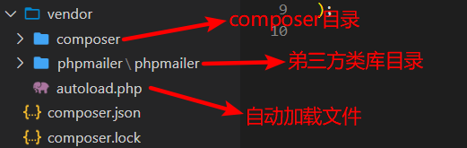
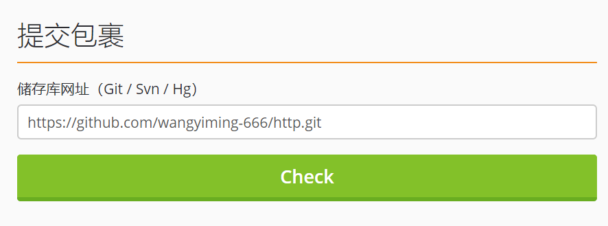
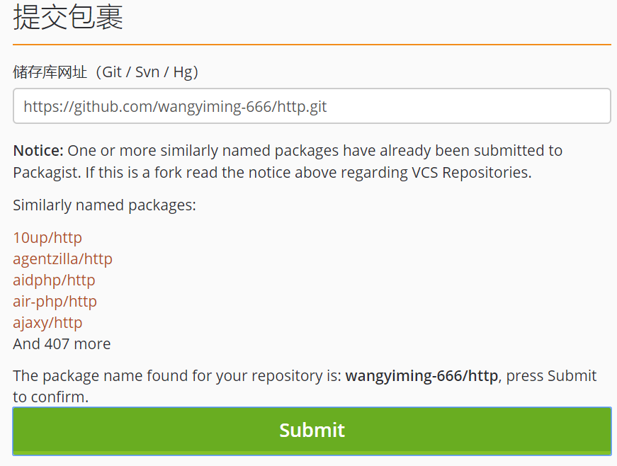
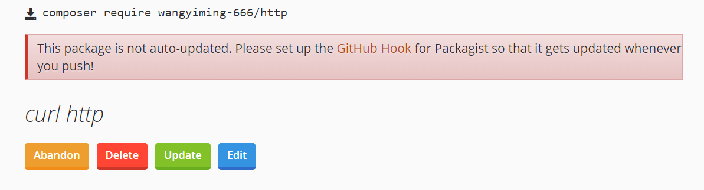
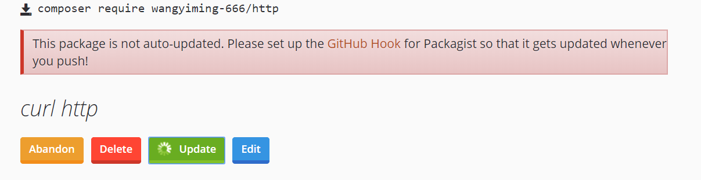
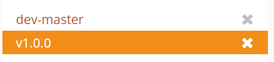

composer类似于nodejs的npm

在安装php的包之前  还需要检索在packagist资源库中检索一下包的存在 运行

```
composer search phpmailer
```

检索结果如下

```
phpmailer/phpmailer PHPMailer is a full-featured email creation and transfer class for PHPswiftmailer/swiftmailer Swiftmailer, free feature-rich PHP mailer
phpmailer/phpmailer PHPMailer is a full-featured email creation and transfer class for PHPvernes/yiimailer Yii extension for sending emails with layouts using PHPMailer
itinerisltd/wp-phpmailer WP PHPMailer provides a clean and simple way to configure WordPress-bundled PHPMailer library, allowing you to quickly get started sending mail through a local or cloud based service of your choice.
msp/smtp SMTP with PHPMailer
zyx/zyx-phpmailer PHPMailer integration for Yii 2 framework
filips123/monolog-phpmailer PHPMailer handler for Monolog
yurunsoft/phpmailer-swoole PHPMailer 支持 Swoole 协程环境
yuan1994/tp-mailer A powerful and beautiful php mailer for All of ThinkPHP and Other PHP Frameworks based SwiftMailer
rmrevin/yii2-postman Mail module for Yii2.
locomotivemtl/charcoal-email Email sending and queueing for Charcoal
dappur/framework A stylish PHP application framework crafted using Slim, Twig, Eloquent and Sentinel designed to get you from clone to production in a matter of minutes.
byjg/mailwrapper A lightweight wrapper for send mail. The interface is tottaly decoupled from the sender. The sender availables are: PHP Mailer, AWS SES Api, Mandril Api.
phpmailerflamin/phpmailer PHPMailer Editado para menos arquivos
```

我们可以发现有很多phpmailer的提供商 

然后我们就可以执行安装啦 运行

```
composer require phpmailer/phpmailer
```

如果出现如下结果说明安装成功

```
Using version ^6.1 for phpmailer/phpmailer
./composer.json has been updated
Loading composer repositories with package information
phpmailer/phpmailer suggests installing psr/log (For optional PSR-3 debug logging)        
phpmailer/phpmailer suggests installing league/oauth2-google (Needed for Google XOAUTH2 authentication)
phpmailer/phpmailer suggests installing hayageek/oauth2-yahoo (Needed for Yahoo XOAUTH2 authentication)
phpmailer/phpmailer suggests installing stevenmaguire/oauth2-microsoft (Needed for Microsoft XOAUTH2 authentication)
phpmailer/phpmailer suggests installing symfony/polyfill-mbstring (To support UTF-8 if the Mbstring PHP extension is not enabled (^1.2))
Writing lock file
Generating autoload files
```

这里我们可以看到根目录下生成了许多文件  我们可以大概了解一下



通过自动加载文件我们就可以引入我们安装的包了 在根目录下新建一个index.php 我们可以在index文件引入一下   代码如下

```php
<?php
//引入自动加载文件
require __DIR__.'/vendor/autoload.php';
// 实例化PHPmailer对象
$mailer = new \PHPMailer\PHPMailer\PHPMailer();
//打印看一下吧
var_dump($mailer);
```

部分输出如下

```
object(PHPMailer\PHPMailer\PHPMailer)#3 (74) { ["Priority"]=> NULL ["CharSet"]=> string(10) "iso-8859-1" ["ContentType"]=> string(10) "text/plain" ["Encoding"]=> string(4) "8bit" ["ErrorInfo"]=> string(0) "" ["From"]=> string(14) "root@localhost" ["FromName"]=> string(9) "Root User" ["Sender"]=> string(0) "" ["Subject"]=> string(0) "" ["Body"]=> string(0) "" ["AltBody"]=> string(0) "" ["Ical"]=> string(0) "" ["MIMEBody":protected]=> string(0) ""
```

composer.json 和 composer.lock 两个文件 

composer.json的内容如下

```php
{
    "require": {
        "phpmailer/phpmailer": "^6.1",
    }
}
```

可以看到require定义了要引入的包名和版本号  其中包含了命名包的机制

如果我们引入了phpmailer/phpmailer包  发现还要一个包   xxx/phpmailer中的一个功能 就可以在require里面填入啦

我们一般都需要安装的是稳定版 （stable） 开发版本为（dev）  

我们可以在composer.json中添加以下配置项

```php
"minimum-stability": "stable"
```

接下来我们就手动安装一个包吧 手动更新composer.json

```php
{
    "require": {
        "phpmailer/phpmailer": "^6.1",
        "phpoffice/phpspreadsheet": "^1.10",
    },
    "minimum-stability": "stable"
}
//然后后运行
composer install
```

就可以看到安装的过程啦！

composer.lock  中说明的安装的具体的版本号  在提交项目的适合要把它和composer.json 一起提交上去哦！

下面我们可以自己制作一个包  首先我们在github上面创建一个空仓库 命名为http   然后创建http文件夹   并下面初始化一个composer.json文件  运行

```
composer init
```

如下

```


  Welcome to the Composer config generator  


This command will guide you through creating your composer.json config.
//填写供应商和包名  格式：供应商/包名
Package name (<vendor>/<name>) [һ/http]: wangyiming-666/http
//包的描述  也可以不填
Description []: curl http
//github的用户名和邮箱
Author [wangyiming-666 <2312892231@qq.com>, n to skip]: wangyiming-666 <2312892231@qq.com>
//发布包的最低要求  dev可以和github同步  stable则需要打tag标签蔡锷可以发布
Minimum Stability []: stable
//默认library即可
Package Type (e.g. library, project, metapackage, composer-plugin) []: library
//授权类型可以不同
License []: MIT

Define your dependencies.
是否定义当前依赖项
Would you like to define your dependencies (require) interactively [yes]? y
//选择依赖包php
Search for a package: php
//这里yes
Would you like to define your dev dependencies (require-dev) interactively [yes]? y
//然后php
Search for a package: php
//输入最低版本约束
Enter the version constraint to require (or leave blank to use the latest version): >=5.3
//预览如下
Search for a package: 

{
    "name": "wangyiming-666/http",
    "description": "curl http",
    "type": "library",
    "require-dev": {
        "php": ">=5.3"
    },
    "license": "MIT",
    "authors": [
        {
            "name": "wangyiming-666",
            "email": "2312892231@qq.com"
        }
    ],
    "minimum-stability": "stable",
    "require": {}
}
//是否创建composer.json 选yes
Do you confirm generation [yes]? y
Would you like to install dependencies now [yes]? y
Loading composer repositories with package information
Updating dependencies (including require-dev)
Nothing to install or update
Writing lock file
Generating autoload files
```

然后为了方便自动加载文件  我们在composer.json内还应该配置映射类库的命名空间的实际目录

```php
   "autoload": {
        "psr-4": {
            "wangyiming\\http\\": "src/http/lib"
        }
    }
```

然后我们在根目录下面创建路径为src/http/lib/Http.php的文件  代码如下

```php
<?php
namespace wangyiming\http;
/**
 * HTTP 请求操作类
 * Class Http
 * @package xiaokeai\http
 */
class Http{
    /**
     * GET请求类
     * @param $url
     * @return bool|string
     */
    public static function requestByGet($url){
         return file_get_contents($url);
    }
}
```

然后我们要建立与composer的关系，加入到自动加载机制（aotuload）中去

运行

```
composer install
```

运行结果如下

```
D:\phpStudy\WWW\http>composer install 
Loading composer repositories with package information 
Updating dependencies (including require-dev) 
Nothing to install or update 
Writing lock file 
Generating autoload files
```

然后我们就可以看到在verndor/composer/autoload_psr4. php 文件中记录了$vendorDir 和 $baseDir 的路径。使用 Composer 安装类库依赖时， Packagist 会自动将自定义的项目文件 放到 vendor 目录下。

可以看到文件内容如下了

```php
<?php

// autoload_psr4.php @generated by Composer

$vendorDir = dirname(dirname(__FILE__));
$baseDir = dirname($vendorDir);

return array(
    'wangyiming\\http\\' => array($baseDir . '/src/http/lib'),
);

```

我们可以在本地测试一下这个包

在跟目录下创建index.php 代码如下

```php
<?php
require __DIR__.'/vendor/autoload.php';
var_dump(strlen(wangyiming\http\Http::requestByGet('http://baidu.com')));
```

然后在浏览器运行 会得到如下结束  说明运行成功

```
int(81)
```

然后推送文章到github  这里不宅说明  可以看以前的文章  [git的简单使用](https://wangyiming-666.github.io/2020/02/27/git的简单使用/)

然后我们要拥有一个packagist账号并登录

访问地址：[点这里](https://packagist.org/register) ， 实现注册和登录操作，不过也可以使用第三 方，如 GitHub 账号实现授权登录，简化注册流程。 

提交包的 GitHub 仓库地址 访问地址：[点这里](https://packagist.org/packages/submit)， 在 Repository URL (Git/Svn/Hg）下方 的输入框中，填写 Git 地址后单击 Check 按钮





然后就点submit就可以提交啦！



当 Composer 获取测试版本（dev）进行依赖包安装时， 会自动同步 GitHub 上最新的 代码，但稳定版（stable）的发布需要在 GitHub 上添加相应的标签（Tag）。下面简单讲 解操作步骤。 

我们可以在本地创建一个tag 然后再推送上去  运行下面的命令创建tag

```
git tag -a v1.0.0 -m'v1.0.0'
//运行如下命名可以查看tag是否添加成功
git tag
//执行结果如下
v1.0.0
```

然后我们把tag推送 执行

```
git push http --tags
//执行结果如下
Enumerating objects: 1, done.
Counting objects: 100% (1/1), done.
Writing objects: 100% (1/1), 158 bytes | 158.00 KiB/s, done.
Total 1 (delta 0), reused 0 (delta 0)
To https://github.com/wangyiming-666/http.git
 * [new tag]         v1.0.0 -> v1.0.0
```

然后点击update  会发现版本已经更新





现在我们测试一下自己的包 在一个新的文件夹下面运行

```
composer composer require wangyiming-666/http
//出现下面结果说明已经正常安装了
$ composer require wangyiming-666/http
Using version ^1.0 for wangyiming-666/http
./composer.json has been updated
Loading composer repositories with package information
Updating dependencies (including require-dev)
Package operations: 1 install, 0 updates, 0 removals 
   - Installing wang] ialin/http (vl.0 . 0) : Loading from cache Writing lock file 
   Generat工ng autoload files 
```

然后我们根据测试的时候一样  再测试一遍就可以啦！