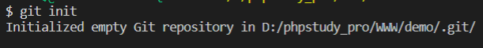

####        **在学习git的过程中我觉得还是有很多知识点需要整理的**

**首先我们要在项目的文件夹下面初始化一个 本地仓库 运行命令**

```
git init
```
****

 **可以看到  在我们的文件夹下面生成了一个.git文件  这个文件夹是在window看不到的  需要打开隐藏文件才可以看到  这里不建议去动这个文件**

**然后我们在文件夹下面建一个index.php文件 并添加点内容**

```php
<?php
echo "现在的时间是:".date('Y-m-d H:i:s');
```

**然后我们把他提交到我们的版本库 运行**

```
git add index.php
```

**这里有时候在提交某些文件的时候  会出现一些提示  git使用了liunx下的换行模式**

**关掉和不关掉都没什么大碍  我这边是把他关了  因为看着不舒服 运行**

```
git config --global core.autocrlf false 
```

**然后我们把他提交到版本库中  运行 -m后面的内容是本次提交的注释说明**

```
$ git commit -m "测试"
[master (root-commit) 3d36c15] 测试
 1 file changed, 2 insertions(+)   
 create mode 100644 index.php
```

**这里我是运行成功了 因为是之前设置过用户名和邮箱 没有设置过的需要运行**

```
git config --global user.name "wangyiming-666” 
git config --global user.email "2312892231@qq.com” 
```

**然后再运行一遍下面的代码  就可以成功了**

```
$ git commit -m "测试"
```

#### ****                  

####  **下面讲一下git的版本信息  以及版本回退操作**

**我们可以修改一下index.php的文件**

```php
<?php
echo "现在的时间是:".date('Y-m-d H:i:s');
echo "我又多出了一行代码呦!";
```

**然后我们运行 如下代码**

```
git status
```

**执行如下**

```
On branch master
Changes not staged for commit:
  (use "git add <file>..." to update what will be committed)
  (use "git restore <file>..." to discard changes in working directory)
        modified:   index.php

no changes added to commit (use "git add" and/or "git commit -a")
```

**要想查看本次修改的内容 执行**

```
git diff
```

**执行结果如下**

```
diff --git a/index.php b/index.php
index d149374..f90d6d7 100644
--- a/index.php
+++ b/index.php
@@ -1,2 +1,3 @@
 <?php
-echo "现在的时间是:".date('Y-m-d H:i:s');
\ No newline at end of file
+echo "现在的时间是:".date('Y-m-d H:i:s');
+echo "我又多出了一行代码呦!";
\ No newline at end of file
```

**然后我们把本次修改的内容提交到版本库中把  依次运行**

```    
git add index.php 
git status  //查看文件状态
git commit -m “加了一行哦！”
```

**运行结果如下**

```
[master 1039ae7] 加了一行代码哦！
 1 file changed, 2 insertions(+), 1 deletion(-)
```

**我们可以查看我们的历史版本 运行**

```
git log
```

运行结果如下

```
commit 1039ae7972f4b054b204cbfaf7639b265483302f (HEAD -> master)
Author: wangyiming-666 <2312892231@qq.com>
Date:   Thu Feb 27 21:48:54 2020 +0800

    加了一行代码哦！

commit 3d36c1521e52f03dcd1fba16c073904fdf80ba5e
Author: wangyiming-666 <2312892231@qq.com>
Date:   Thu Feb 27 21:10:34 2020 +0800

    测试
```

有了版本日志  我们就可以回退到以前的版本了 运行

```
git reset --hard 版本号   //就是上面的commit 输入前几个数字即可
```

