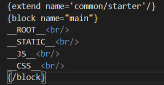
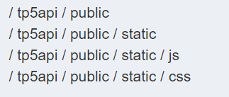
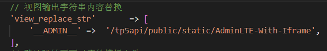

#### 1、加载静态资源的路径

**__ROOT__：项目目录**

**__STATIC__ ：项目目录下的static目录**

**__JS__ ：项目目录下的static/js目录**

**__CSS__：项目目录下的static/css目录**

**我们可以用view模板打印这些常量的具体路径**

****

**输出效果如下**

****

**打开application文件夹下的config文件，可根据你自己需要自定义资源常量，定义好后常量就可以在模板文件中使用常量了。**

**例如：**

****

#### 2、预定义常量

**预定义常量是指系统内置定义好的常量，不会随着环境的变化而变化，包括：**

**EXT 类库文件后缀（.php）**

**THINK_VERSION 框架版本号**

#### 3、路径常量

**系统和应用的路径常量用于系统默认的目录规范，可以通过重新定义改变，如果不希望定制目录，这些常量一般不需要更改。**

```php
DS 当前系统的目录分隔符

THINK_PATH 框架系统目录 

ROOT_PATH 框架应用根目录

APP_PATH 应用目录（默认为application）

CONF_PATH 配置目录（默认为APP_PATH）

LIB_PATH 系统类库目录（默认为 THINK_PATH.'library/'）

CORE_PATH 系统核心类库目录 （默认为 LIB_PATH.'think/'）

TRAIT_PATH 系统trait目录（默认为 LIB_PATH.'traits/'）

EXTEND_PATH 扩展类库目录（默认为 ROOT_PATH . 'extend/')

VENDOR_PATH 第三方类库目录（默认为 ROOT_PATH . 'vendor/'）

RUNTIME_PATH 应用运行时目录（默认为 ROOT_PATH.'runtime/'）

LOG_PATH 应用日志目录 （默认为 RUNTIME_PATH.'log/'）

CACHE_PATH 项目模板缓存目录（默认为 RUNTIME_PATH.'cache/'）

TEMP_PATH 应用缓存目录（默认为 RUNTIME_PATH.'temp/'）
```

#### 4、系统常量

**系统常量会随着开发环境的改变或者设置的改变而产生变化。**

```php
IS_WIN 是否属于Windows 环境 

IS_CLI 是否属于命令行模式 

THINK_START_TIME 开始运行时间（时间戳）

THINK_START_MEM 开始运行时候的内存占用

ENV_PREFIX 环境变量配置前缀
```

